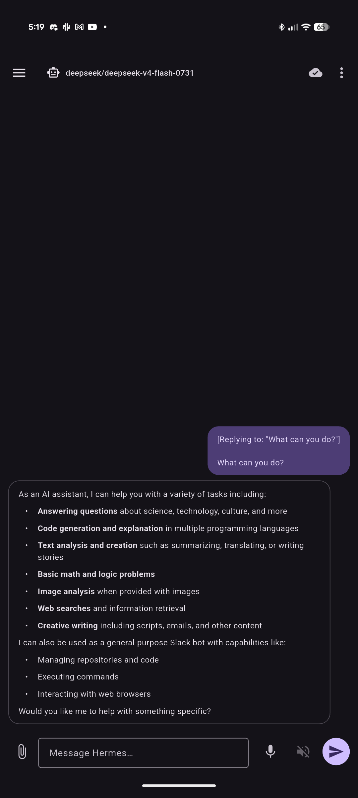
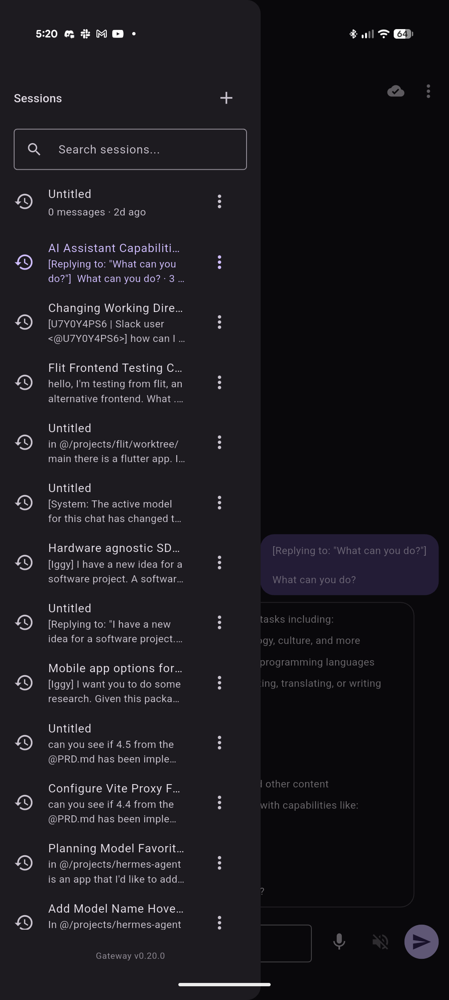
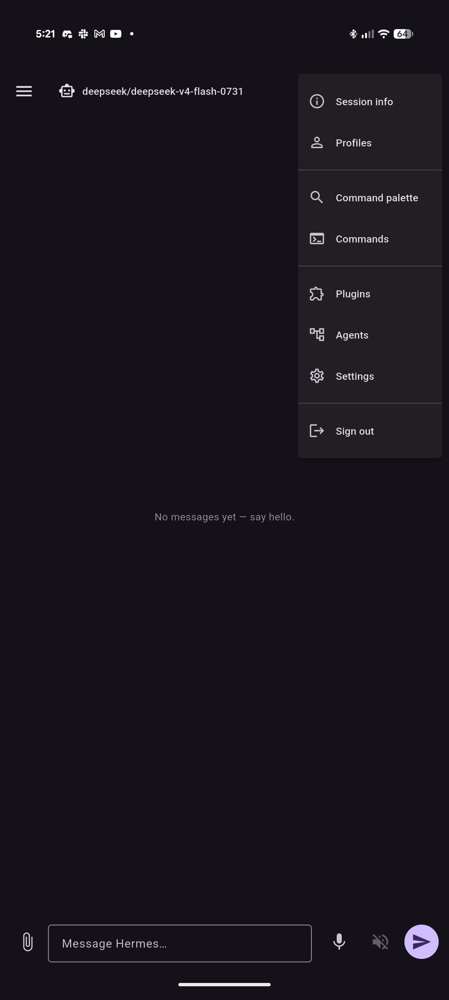
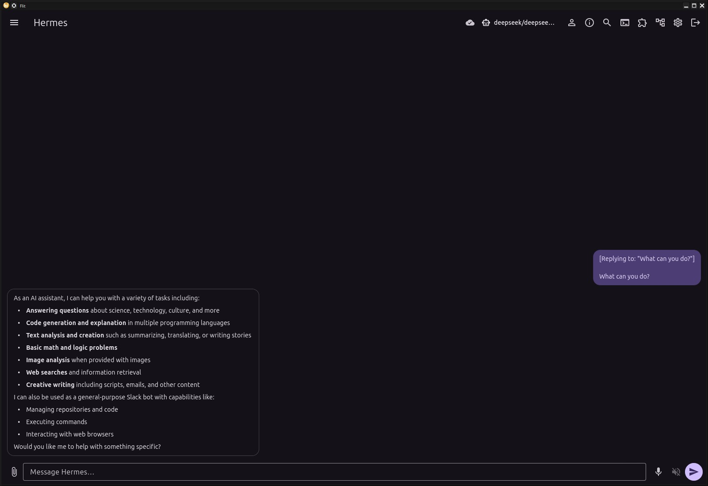
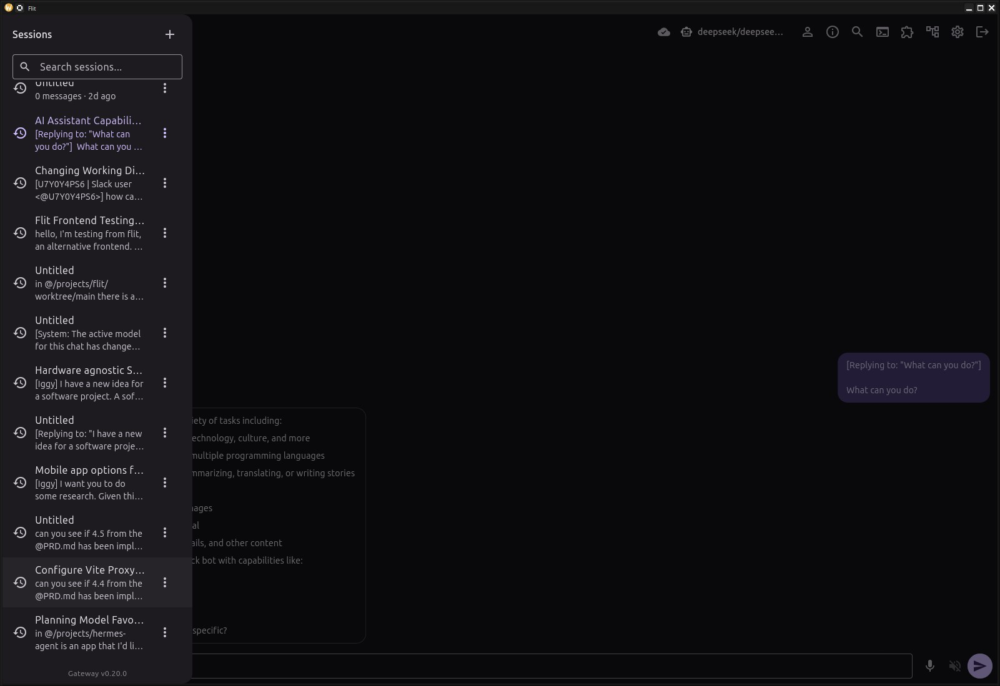

# Flit

A cross-platform (mobile + desktop) client for [Hermes Agent](https://github.com/NousResearch/hermes-agent),
built in Flutter. It connects to a running Hermes **gateway** and gives you
chat, tool-calling, model selection, plugins (kanban, etc.), and full parity
with the existing desktop/TUI experiences.

## What this is

Hermes already ships four clients: a desktop app (Electron), a web dashboard,
a terminal UI (Ink/React), and a plain CLI. This project adds a **fifth**: a
Flutter app that runs on iOS, Android, macOS, Windows, and Linux from one
codebase, with mobile as a first-class target the others don't serve.

The app is a **gateway client**. It does *not* embed or spawn the Python
backend the way the Electron desktop app does — it connects to a gateway you
point it at.

## How it talks to Hermes

The app speaks the same protocol the desktop app and TUI use: **newline-delimited
JSON-RPC 2.0 over a WebSocket** at `/api/ws`, dispatched by the gateway's
`tui_gateway.server.dispatch()`. Some features (notably the kanban plugin) are
served as **REST** on the same host/port.

The full, source-grounded protocol contract lives in
[`docs/reference/`](docs/reference/). Every claim there is cited to a
`file:line` in the `hermes-agent` repo so an implementer can verify it.

## Repository layout

```
flit/
├── README.md                     ← you are here
├── AGENTS.md / CLAUDE.md         ← build/test commands + architecture rules for agents
├── docs/
│   ├── roadmap.md                ← phase overview + sequencing
│   ├── reference/                ← the gateway contract (grounded in source)
│   │   ├── 00-overview.md
│   │   ├── 01-gateway-protocol.md
│   │   ├── 02-rpc-index.md
│   │   ├── 03-mvp-wire-shapes.md
│   │   ├── 04-app-architecture.md
│   │   ├── 05-conventions.md
│   │   ├── 06-kanban-rest.md
│   │   └── …(07-10) phase-specific wire shapes & deep links
│   ├── design/
│   │   └── theming.md            ← Material 3 now, "match Hermes skin" later
│   └── phases/                   ← per-phase tickets (P0-… through P9-…)
└── app/                          ← the Flutter project
```

## Prerequisites

- **Flutter SDK 3.44.8** (stable channel). The dev machine keeps it at
  `~/flutter`; add `~/flutter/bin` to your `PATH`. See
  [Phase 0](docs/phases/phase-0-foundation.md) for setup notes.
- A running Hermes gateway to connect to (local `hermes dashboard`, or a remote
  one).
- **Linux build deps** (Debian/Ubuntu), needed for the GTK + secure-storage
  native build:

  ```sh
  sudo apt install clang cmake ninja-build libgtk-3-dev libsecret-1-dev xz-utils
  ```

  `libsecret-1-dev` is required by `flutter_secure_storage` (used to store
  session tokens / cookies). Without it the Linux desktop build fails at
  CMake's `pkg_check_modules` step with `libsecret-1>=0.18.4 … not found`.
- **macOS**: Xcode + CocoaPods (for iOS/macOS targets).
- **Windows**: Visual Studio with the "Desktop development with C++" workload.
- **Android**: Android Studio / Android SDK + NDK (NDK is deferred; see roadmap).
- **Web**: no extra deps beyond Flutter.

## Develop

All commands run from [`app/`](app/):

```sh
cd app
export PATH="$HOME/flutter/bin:$PATH"
flutter pub get
dart run build_runner build --delete-conflicting-outputs   # codegen (freezed/json/riverpod)
flutter analyze                                            # must stay clean
flutter test
flutter run -d linux
```

Builds: `task build-android|build-ios|build-web|build-macos|build-windows|build-linux`
(override with `BUILD_MODE=debug task …`; default is `release`). See
[`app/README.md`](app/README.md) and [`AGENTS.md`](AGENTS.md) for the full
command reference, pinned dependencies, and architecture rules.

## Screenshots

### Android





### Linux




## For implementers

The plan is written so that most tickets can be picked up and completed
**independently**. Before implementing (or extending) any ticket:

1. Read [`docs/reference/05-conventions.md`](docs/reference/05-conventions.md) once.
2. Read the ticket. Each ticket lists its **inputs** (which reference sections
   it depends on), **deliverables** (files to create), and **acceptance
   criteria** (how to know it's done).
3. Ground every wire interaction in [`docs/reference/03-mvp-wire-shapes.md`](docs/reference/03-mvp-wire-shapes.md)
   or the relevant reference section. Do not invent RPC method names or fields.

## Release process

Create a tag with a description (`git tag --sign`) and then push (`git push origin --tags`). CI creates the github
release, etc.
